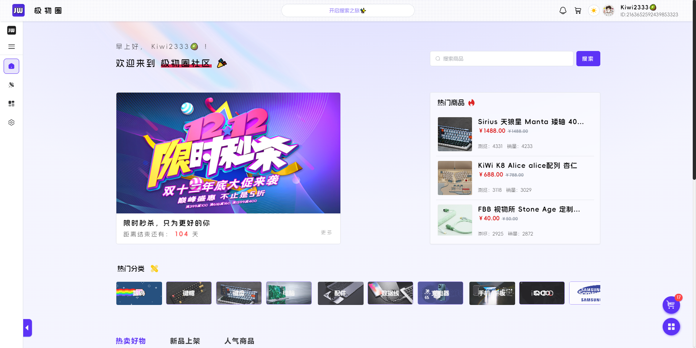
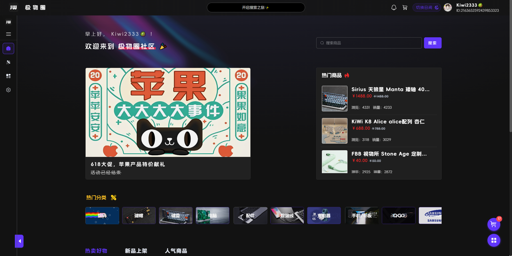
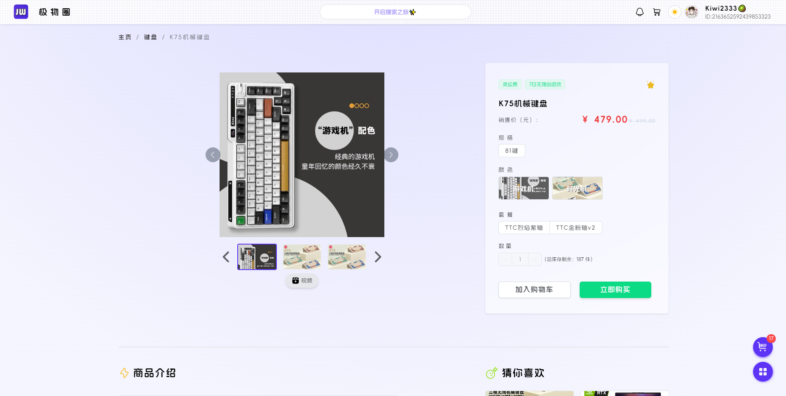

<h2 align=center margin="10em" style="margin:4em;letter-spacing:0.3em;"> 极物圈</h2>

###  介绍
极物圈是一个商城、社交平台，用户可以在这里购买商品（虚拟），发布自己的帖子，评论别人的帖子。
###  技术

```
基于Nuxt3 + element-plus + pinia 基本框架
```

###  体验
[ 极物圈 —— 体验入口](https://kiwi2333.netlify.app)

###  项目截图








### 起步 | Project Setup
```
pnpm install
```
### 开发 | Dev

```
pnpm run dev
```

### 构建 | Build

```
pnpm run build
```
